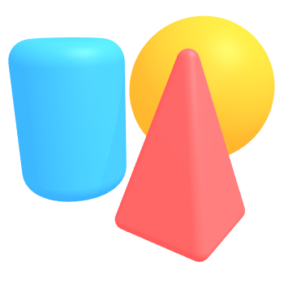

# Hi, I'm Sait :wave:

Frontend developer and aspiring computer scientist.

## Life

:shipit: [**Birsk Institute**][ur] Dean's Scholar, Linguistics  
:shipit: [**42tm**][42tm] founder & software engineer  
:shipit: [**UR CSUG**][csug] tutor → tutoring chair  
:shipit: [**DandyHacks**][dandyhacks] 2021 First Place winner, 2022 organizer

[ur]: https://rochester.edu
[42tm]: https://github.com/42tm
[csug]: https://ur-csug.org
[dandyhacks]: https://dandyhacks.net

## Skills

:coffee: **Java**, Java Swing  
:snake: **Python**, PyGTK  
:sunglasses: **JavaScript**, React.js, redux  
:paintbrush: Figma, Paint (2D)
:pick: VSCode, Windows, Bash, command line

[inkscape]: https://inkscape.org
[spline]: https://spline.design

###### Learning: Data structures, design patterns, full-stack web development

## Sponsors

Many thanks to [Brent][brettz9] and JT for sponsoring my work.

[brettz9]: http://example.me

---

